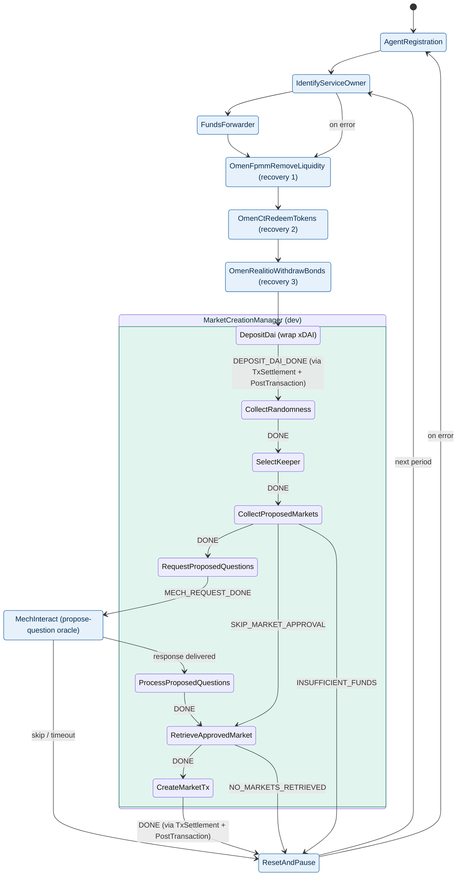

# Market Creator

An autonomous service built on the [Open Autonomy](https://stack.olas.network/open-autonomy/) framework that **creates and manages prediction markets** on [Omen](https://aiomen.eth.limo/) (Gnosis Chain), using recent news evaluated by an LLM Mech oracle.

It is the sibling of [market-resolver](https://github.com/valory-xyz/market-resolver), which handles the resolution side; the two share the same fund-recovery sub-skills.

## What it does

Each cycle the agent runs an ABCI FSM that:

- **Funds the safe** -- wraps xDAI into wxDAI (`DepositDai`) for market liquidity.
- **Assesses demand** -- `CollectProposedMarkets` computes how many markets are still needed per upcoming opening day (target `MARKETS_TO_APPROVE_PER_DAY` over `APPROVE_MARKET_EVENT_DAYS_OFFSET` days), subject to throttles and a funding guard.
- **Generates questions via Mech** -- `RequestProposedQuestions` calls the `propose-question` Mech tool to turn current news into candidate questions, which are pushed to an external **market approval server**.
- **Creates markets on-chain** -- `RetrieveApprovedMarket` pulls an approved market and `CreateMarketTx` builds a single multisend: FPMM deployment (`FPMMDeterministicFactory`) + initial liquidity + Realitio question.
- **Recovers locked funds** -- removes LP from expired markets, redeems winning conditional tokens, and reclaims Realitio bonds (three dedicated sub-skills, shared with market-resolver).

## Architecture

`market_maker_abci` is a **composed** ABCI app: it chains one repo-owned skill (`market_creation_manager_abci`, the core logic) with several third-party sub-apps (registration, fund recovery, Mech, transaction settlement, reset/pause). Any step that goes on-chain routes through the shared `TransactionSettlement` + `PostTransaction` multiplexer; question generation is delegated to a `MechInteract` request.



### Key design decisions

- **Question generation runs in the Mech, not the agent.** The service only sends a `propose-question` request via `mech_interact_abci`; the OpenAI / NewsAPI / Serper keys it needs live on the **Mech**, not on this service. Operator params (`TOPICS`, `NEWS_SOURCES`, `num_questions`) travel as Mech `extra_attributes`.
- **Approval-server indirection.** Generated questions are pushed to an external approval server; only *approved* markets are created on-chain, so markets can be gated before funds are committed.
- **Shared recovery chain.** LP removal, CT redemption and bond withdrawal reuse the same sub-skills as market-resolver.

## Prepare the environment

- System requirements:
  - Python `>=3.10, <3.15`
  - [Tendermint](https://docs.tendermint.com/v0.34/introduction/install.html) `==0.34.19`
  - [uv](https://docs.astral.sh/uv/)
  - [Docker Engine](https://docs.docker.com/engine/install/) + [Docker Compose](https://docs.docker.com/compose/install/)

```bash
git clone https://github.com/valory-xyz/market-creator.git
cd market-creator
uv sync --all-groups
source .venv/bin/activate
autonomy init --reset --author valory --remote --ipfs --ipfs-node "/dns/registry.autonolas.tech/tcp/443/https"
autonomy packages sync --update-packages
```

You also need a Gnosis keypair (`keys.json`) and a [Safe](https://safe.global/); register the service on the [OLAS registry](https://registry.olas.network/gnosis/services/mint) (canonical agent id `12`) or use your own Safe.

## Configuration

Defaults live in [service.yaml](packages/valory/services/market_maker/service.yaml); every variable below is an env override. Note the LLM/news/search API keys are configured on the **Mech**, not here.

| Variable | Purpose |
|---|---|
| `ALL_PARTICIPANTS` | JSON list of agent EOAs in the service. |
| `SAFE_CONTRACT_ADDRESS` | Gnosis Safe multisig controlled by the agents. |
| `GNOSIS_LEDGER_RPC` | Gnosis RPC endpoint (use a private one in production). |
| `ON_CHAIN_SERVICE_ID` | Olas registry service id. |
| `SUBGRAPH_API_KEY` | The Graph key for the Omen/Realitio subgraphs. |
| `MARKET_APPROVAL_SERVER_URL` / `MARKET_APPROVAL_SERVER_API_KEY` | Approval-server endpoint and key (server reachable from the agent). |
| `MARKETS_TO_APPROVE_PER_DAY` | Target number of markets per opening day. |
| `APPROVE_MARKET_EVENT_DAYS_OFFSET` | How far ahead markets are opened (days). |
| `TOPICS` / `NEWS_SOURCES` | News topics / sources, forwarded to the Mech tool. |
| `MAX_MARKETS_PER_STORY` | Upper bound on `num_questions` requested per Mech call. |
| `INITIAL_FUNDS` | Initial wxDAI liquidity per market (the funding the guard checks against). |
| `MARKET_FEE` | FPMM LP fee, percent. |
| `MARKET_TIMEOUT` | Realitio answer window, days. |
| `COLLATERAL_TOKEN_CONTRACT` | Collateral token (default [WxDAI](https://gnosisscan.io/address/0xe91d153e0b41518a2ce8dd3d7944fa863463a97d)). |

### Market approval server

The service proposes markets to a separate approval server before creating them on-chain ([market_approval_server/](market_approval_server/market_approval_server.py)):

```bash
echo -n "your_api_key" | sha256sum   # hash goes into the config under "api_keys"
# create market_approval_server/server_config.json with empty market maps + the hash
python market_approval_server/market_approval_server.py   # serves on :5000
```

## Run the service

```bash
# Docker deployment
autonomy fetch --local --service valory/market_maker && cd market_maker
autonomy build-image
cp /path/to/keys.json .
autonomy deploy build --n 1 -ltm
autonomy deploy run --build-dir abci_build/

# or, local agent (development) -- requires `pip install open-aea-helpers` and a .env
aea-helpers run-service --name valory/market_maker --env-file .env
```

## Development

After editing anything under `packages/`:

1. **Format + lint** — `make formatters`, then `make code-checks` (black, isort, flake8, mypy, pylint, darglint).
2. **FSM changes** — keep the `Event` enum, `rounds.py`, `fsm_specification.yaml`, and tests in sync, then regenerate the specs + docstrings:

   ```bash
   autonomy analyse fsm-specs --update --package packages/valory/skills/market_creation_manager_abci
   autonomy analyse fsm-specs --update --package packages/valory/skills/market_maker_abci
   autonomy analyse docstrings --update
   ```

3. **Lock package hashes** — `autonomy packages lock`.
4. **Tests** (100% statement + branch coverage enforced) — `tomte tox -e py3.11-linux`.

## Third-party dependencies

Synced from IPFS via `autonomy packages sync` (not committed to git):

| Repository | Provides |
|---|---|
| [open-autonomy](https://github.com/valory-xyz/open-autonomy) | `abstract_round_abci`, registration, transaction_settlement, reset_pause, termination |
| [open-aea](https://github.com/valory-xyz/open-aea) | protocols, connections, base contracts (gnosis_safe, multisend, service_registry) |
| [mech-interact](https://github.com/valory-xyz/mech-interact) | `mech_interact_abci` skill, mech / mech_mm / ierc1155 contracts |
| [omen-protocol](https://github.com/valory-xyz/omen-protocol) | realitio, realitio_proxy, conditional_tokens, fpmm contracts; the LP-removal / CT-redeem / bond-withdrawal recovery skills |
| [genai](https://github.com/valory-xyz/genai) | GenAI / NVM subscription packages |

## Further reading

- [`CONTRIBUTING.md`](CONTRIBUTING.md) — development workflow and conventions
- [`SECURITY.md`](SECURITY.md) — security policy
- Reference service: [valory-xyz/trader](https://github.com/valory-xyz/trader); sibling resolver: [valory-xyz/market-resolver](https://github.com/valory-xyz/market-resolver)

## License

Apache License 2.0
